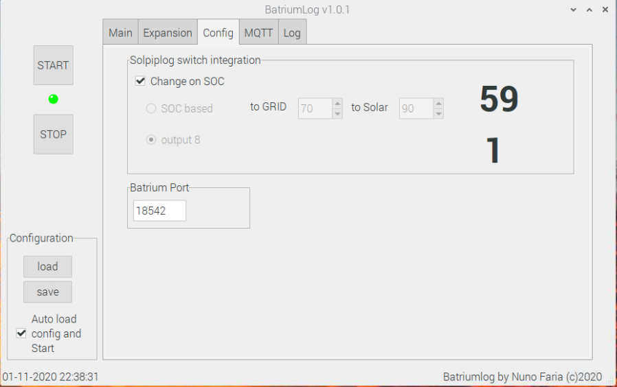

# BatriumLog

* Batrium bms logger for raspberry pi
* Sends data per MQTT to your local broker ( for Home Automation for example ) and to your local Emoncms account.
* Interfaces with solpiplog to change the inverter to switch to grid or solar, based on predifined SOC values.

## Instalation
* make a folder on your raspberry named batrium
* copy the zip file from the latest release  to that folder and unzip it 
* copy batrium.desktop to your raspberry desktop
* execute it

## [Values sent over MQTT](/docs/mqttvalues.md)

## Appearance

